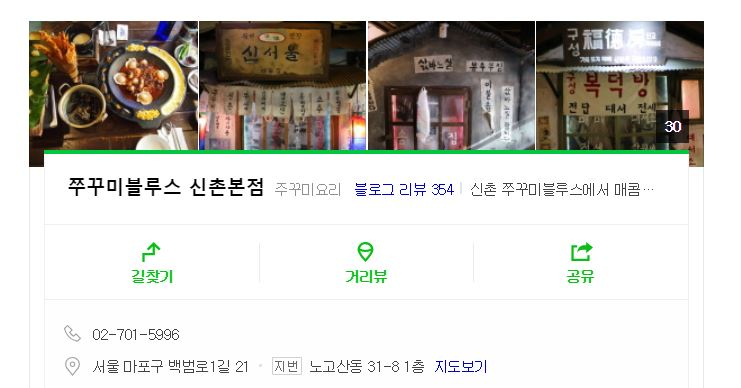
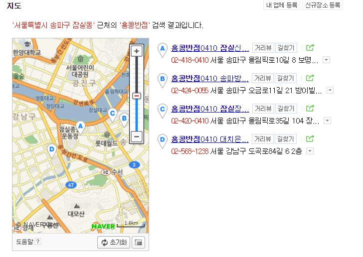

# jellynlp-django

 챗봇에서 사용되는 기능 중, 파이썬으로 구현된 코드들을 django 프레임워크에 올려놓은 REST API 서버이다.

## 0. 환경

**개발 환경**

- Python 3.6
- Django 2.1

**배포 환경**

- AWS Elastic Beanstalk

## nlp

**[README ](./nlp/README.md)** 

- Elastic Beanstalk 환경에서, konlpy의 dependency 인 jpype 모듈이 제대로 작동하지 않는 문제가 발생한다.

- konlpy의 dependency중 jpype를 py4j로 수정한 모듈로 설치하였다

  >https://github.com/nazgul33/konlpy

## worry

**[README ](./worry/README.md)**

## image_crawl

bs4를 이용하여, 인자로 받은 키워드로 네이버 이미지 검색을 하여, 첫 페이지의 이미지들의 소스 링크를 리스트로 return 한다.

**main**

- 하나의 키워드에 대한 이미지 리스트를 return

**two** 

- 두개의 키워드에 대한 이미지 리스트들을 return
- 어느 하나의 결과라도 이미지 검색이 되지 않으면, 'no image'를 return

## verify_close

bs4를 이용하여, restaurant 테이블에 있는 모든 음식점을 네이버에 검색하여, 폐점 여부를 판단하여 폐점여부를 나타내는 closedown을 업데이트시키는 API이다.

>food-api-server을 통해 DB에 쿼리를 전달한다.

restaurant 테이블의 칼럼 수가 수천 개이므로, 빠른 속도를 위해 multiprocessing모듈을 이용해 프로세스 3개로 병렬화 하였다.

>프로세스를 4개이상으로 하는 경우 더 빠른 속도를 기대할 수 있지만, 
>
>네이버에서 봇임을 판단하고 IP밴을 시킨다. 프로세스를 3개 이하로 유지하는 것을 권장한다.

폐점 여부는 각 음식점을 네이버에 검색한 결과, 3가지 경우의 수로 판단한다.

**첫번째 경우**

**두번째 경우**

**세번째 경우**

**음식점의 검색 결과가, 위 3가지중 하나로 나오지 않게 되는경우, 폐점으로 판단하고 closedown을 업데이트한다.**

